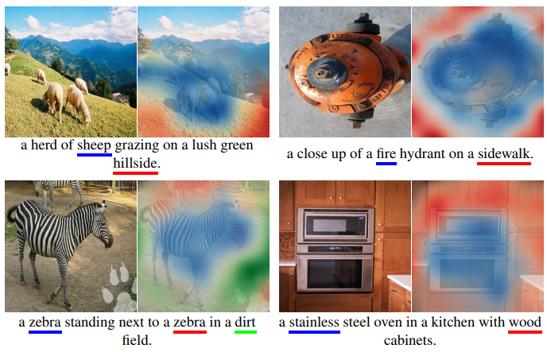

# Vision Language Warehouse
Bridging visual modalities and natural language is a interesting yet challenging task. It attracts more and more research highlights and requires interdisciplinary efforts from Computer Vision, Natural Language Processing and Machine Learning.

This repository contains recent papers on __Image Captioning__, __Text-Image Matching__ and __Text-to-Image Generation__. 

## Content
- <a href="#image_captioning">Image Captioning</a>
- <a href="#text-image_matching">Text-Image Matching</a>
- <a href="#text-to-image_generation">Text-to-Image Generation</a>

<h2>Image captioning<h2>

### Template-based methods
[VIsual TRAnslator: Linking perceptions and natural language descriptions](http://www.dfki.de/~flint/papers/air94.pdf)

[Learning visually grounded words and syntax for a scene description task](https://www.media.mit.edu/cogmac/publications/csl.pdf)

[Every picture tells a story: Generating sentences from images](https://www.cs.cmu.edu/~afarhadi/papers/sentence.pdf)

[Babytalk: Understanding and generating simple image descriptions](http://www.tamaraberg.com/papers/generation_cvpr11.pdf)

### Deep-learning-based approaches
[Show and Tell: A Neural Image Caption Generator](https://arxiv.org/pdf/1411.4555.pdf) (CVPR2015)

[Deep Visual-Semantic Alignments for Generating Image Descriptions](https://cs.stanford.edu/people/karpathy/cvpr2015.pdf) (CVPR2015)

[Show, Attend and Tell: Neural Image Caption Generation with Visual Attention](https://arxiv.org/pdf/1502.03044.pdf) (ICML2015)

[Scheduled Sampling for Sequence Prediction with Recurrent Neural Networks](https://arxiv.org/pdf/1506.03099.pdf) (NIPS2015)

[Areas of Attention for Image Captioning](https://arxiv.org/pdf/1612.01033.pdf) (ICCV2017)

[Knowing When to Look: Adaptive Attention via A Visual Sentinel for Image Captioning](https://arxiv.org/pdf/1612.01887.pdf) (CVPR2017)

[SCA-CNN: Spatial and Channel-wise Attention in Convolutional Networks for Image Captioning](https://arxiv.org/pdf/1611.05594.pdf) (CVPR2017)

[Self-critical Sequence Training for Image Captioning](https://arxiv.org/pdf/1612.00563.pdf) (CVPR2017)

[Stack-Captioning: Coarse-to-Fine Learning for Image Captioning](https://arxiv.org/pdf/1709.03376.pdf) (arXiv 2017)

[Bottom-Up and Top-Down Attention for Image Captioning and Visual Question Answering](https://arxiv.org/pdf/1707.07998.pdf) (CVPR2018)

[Convolutional Image Captioning](https://arxiv.org/pdf/1711.09151.pdf) (CVPR2018)

[Rethinking the Form of Latent States in Image Captioning](http://openaccess.thecvf.com/content_ECCV_2018/papers/Bo_Dai_Rethinking_the_Form_ECCV_2018_paper.pdf) (ECCV2018)

[Recurrent Fusion Network for Image Captioning](https://arxiv.org/pdf/1807.09986.pdf) (ECCV2018)

### Materials
#### GitHub repositories
[pytorch-tutorial/image_captioning](https://github.com/yunjey/pytorch-tutorial/tree/master/tutorials/03-advanced/image_captioning)

[ruotianluo/ImageCaptioning.pytorch](https://github.com/ruotianluo/ImageCaptioning.pytorch)

[tylin/coco-caption](https://github.com/tylin/coco-caption)

[alecwangcq/show-attend-and-tell](https://github.com/alecwangcq/show-attend-and-tell)

[sgrvinod/a-PyTorch-Tutorial-to-Image-Captioning](https://github.com/sgrvinod/a-PyTorch-Tutorial-to-Image-Captioning)

[daveredrum/image-captioning](https://github.com/daveredrum/image-captioning)

#### Docs
[Deep Visual-Semantic Alignments for Generating Image Descriptions](https://cs.stanford.edu/people/karpathy/deepimagesent/)

[Automated Image Captioning](https://cs.stanford.edu/people/karpathy/sfmltalk.pdf)

[Caption this, with TensorFlow](https://www.oreilly.com/learning/caption-this-with-tensorflow)

[Soft & hard attention](https://jhui.github.io/2017/03/15/Soft-and-hard-attention/)

<h2>Text-Image Matching</h2>

[Cross-modal Retrieval with Correspondence Autoencoder](https://people.cs.clemson.edu/~jzwang/1501863/mm2014/p7-feng.pdf) (ACMMM2014)

[Unifying Visual-Semantic Embeddings with Multimodal Neural Language Models](https://arxiv.org/pdf/1411.2539.pdf) (arXiv 2014)

[Multimodal Convolutional Neural Networks for Matching Image and Sentence](https://arxiv.org/pdf/1504.06063.pdf) (ICCV2015)

[Identity-Aware Textual-Visual Matching with Latent Co-attention](http://openaccess.thecvf.com/content_ICCV_2017/papers/Li_Identity-Aware_Textual-Visual_Matching_ICCV_2017_paper.pdf) (ICCV2017)

[Instance-aware Image and Sentence Matching with Selective Multimodal LSTM](http://openaccess.thecvf.com/content_cvpr_2017/papers/Huang_Instance-Aware_Image_and_CVPR_2017_paper.pdf) (CVPR2017)

[Deep Cross-Modal Projection Learning for Image-Text Matching](http://openaccess.thecvf.com/content_ECCV_2018/papers/Ying_Zhang_Deep_Cross-Modal_Projection_ECCV_2018_paper.pdf) (ECCV2018)

[End-to-end cross-modality retrieval with CCA projections and pairwise ranking loss](https://link.springer.com/content/pdf/10.1007%2Fs13735-018-0151-5.pdf) (JMIR2018)

[Look, Imagine and Match: Improving Textual-Visual Cross-Modal Retrieval with Generative Models](https://arxiv.org/pdf/1711.06420.pdf) (CVPR2018)

<h2>Text-to-Image Generation</h2>

[Generative Adversarial Text to Image Synthesis](https://arxiv.org/pdf/1605.05396.pdf) (arXiv 2016)

[ChatPainter: Improving Text to Image Generation using Dialogue](https://arxiv.org/pdf/1802.08216.pdf) (arXiv 2018)

