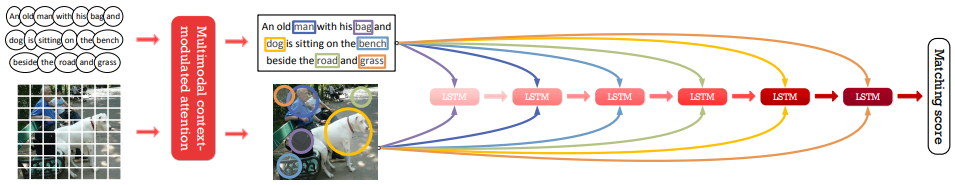
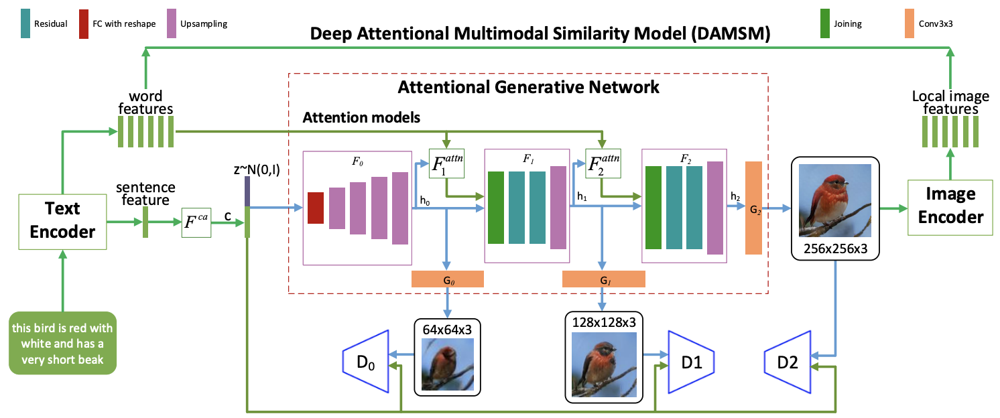

# Vision Language Warehouse
Bridging visual modalities and natural language is a interesting yet challenging task. It attracts more and more research highlights and requires interdisciplinary efforts from Computer Vision, Natural Language Processing and Machine Learning.

This repository contains recent papers, projects and materials on __Image Captioning__, __Text-Image Matching__ and __Text-to-Image Generation__. 

## Content
- <a href="#image_captioning">Image Captioning</a>
- <a href="#text-image_matching">Text-Image Matching</a>
- <a href="#text-to-image_generation">Text-to-Image Generation</a>

<h2>Image captioning</h2>

### Template-based methods
VIsual TRAnslator: Linking perceptions and natural language descriptions [PDF](http://www.dfki.de/~flint/papers/air94.pdf)

Learning visually grounded words and syntax for a scene description task [PDF](https://www.media.mit.edu/cogmac/publications/csl.pdf)

Every picture tells a story: Generating sentences from images [PDF](https://www.cs.cmu.edu/~afarhadi/papers/sentence.pdf)

Babytalk: Understanding and generating simple image descriptions [PDF](http://www.tamaraberg.com/papers/generation_cvpr11.pdf)

### Deep-learning-based approaches
Show and Tell: A Neural Image Caption Generator (CVPR2015) [PDF](https://arxiv.org/pdf/1411.4555.pdf)

Deep Visual-Semantic Alignments for Generating Image Descriptions (CVPR2015) [PDF](https://cs.stanford.edu/people/karpathy/cvpr2015.pdf) [code](https://github.com/karpathy/neuraltalk2) [site](https://cs.stanford.edu/people/karpathy/deepimagesent/)

Show, Attend and Tell: Neural Image Caption Generation with Visual Attention (ICML2015) [PDF](https://arxiv.org/pdf/1502.03044.pdf) [code](https://github.com/kelvinxu/arctic-captions) [site](http://kelvinxu.github.io/projects/capgen.html)

Scheduled Sampling for Sequence Prediction with Recurrent Neural Networks (NIPS2015) [PDF](https://arxiv.org/pdf/1506.03099.pdf) 

Areas of Attention for Image Captioning (ICCV2017) [PDF](https://arxiv.org/pdf/1612.01033.pdf)

Knowing When to Look: Adaptive Attention via A Visual Sentinel for Image Captioning (CVPR2017) [PDF](https://arxiv.org/pdf/1612.01887.pdf) [code](https://github.com/jiasenlu/AdaptiveAttention)

SCA-CNN: Spatial and Channel-wise Attention in Convolutional Networks for Image Captioning (CVPR2017) [PDF](https://arxiv.org/pdf/1611.05594.pdf) [code](https://github.com/zjuchenlong/sca-cnn.cvpr17)

Self-critical Sequence Training for Image Captioning (CVPR2017) [PDF](https://arxiv.org/pdf/1612.00563.pdf)

Stack-Captioning: Coarse-to-Fine Learning for Image Captioning (AAAI2018) [PDF](https://arxiv.org/pdf/1709.03376.pdf) [code](https://github.com/gujiuxiang/Stack-Captioning)

Bottom-Up and Top-Down Attention for Image Captioning and Visual Question Answering (CVPR2018) [PDF](https://arxiv.org/pdf/1707.07998.pdf) [code](https://github.com/peteanderson80/bottom-up-attention)

Convolutional Image Captioning (CVPR2018) [PDF](https://arxiv.org/pdf/1711.09151.pdf) [code](https://github.com/aditya12agd5/convcap)

Rethinking the Form of Latent States in Image Captioning (ECCV2018) [PDF](http://openaccess.thecvf.com/content_ECCV_2018/papers/Bo_Dai_Rethinking_the_Form_ECCV_2018_paper.pdf) [code](https://github.com/doubledaibo/2dcaption_eccv2018)

Recurrent Fusion Network for Image Captioning (ECCV2018) [PDF](https://arxiv.org/pdf/1807.09986.pdf)

### Materials
#### GitHub repositories
[pytorch-tutorial/image_captioning](https://github.com/yunjey/pytorch-tutorial/tree/master/tutorials/03-advanced/image_captioning)

[ruotianluo/ImageCaptioning.pytorch](https://github.com/ruotianluo/ImageCaptioning.pytorch)

[tylin/coco-caption](https://github.com/tylin/coco-caption)

[alecwangcq/show-attend-and-tell](https://github.com/alecwangcq/show-attend-and-tell)

[sgrvinod/a-PyTorch-Tutorial-to-Image-Captioning](https://github.com/sgrvinod/a-PyTorch-Tutorial-to-Image-Captioning)

[daveredrum/image-captioning](https://github.com/daveredrum/image-captioning)

#### Docs
[Deep Visual-Semantic Alignments for Generating Image Descriptions](https://cs.stanford.edu/people/karpathy/deepimagesent/)

[Automated Image Captioning](https://cs.stanford.edu/people/karpathy/sfmltalk.pdf)

[Caption this, with TensorFlow](https://www.oreilly.com/learning/caption-this-with-tensorflow)

[Soft & hard attention](https://jhui.github.io/2017/03/15/Soft-and-hard-attention/)

<h2>Text-Image Matching</h2>

Cross-modal Retrieval with Correspondence Autoencoder (ACMMM2014) [PDF](https://people.cs.clemson.edu/~jzwang/1501863/mm2014/p7-feng.pdf)

Unifying Visual-Semantic Embeddings with Multimodal Neural Language Models (arXiv 2014) [PDF](https://arxiv.org/pdf/1411.2539.pdf)

Multimodal Convolutional Neural Networks for Matching Image and Sentence (ICCV2015) [PDF](https://arxiv.org/pdf/1504.06063.pdf)

Identity-Aware Textual-Visual Matching with Latent Co-attention (ICCV2017) [PDF](http://openaccess.thecvf.com/content_ICCV_2017/papers/Li_Identity-Aware_Textual-Visual_Matching_ICCV_2017_paper.pdf)

Instance-aware Image and Sentence Matching with Selective Multimodal LSTM (CVPR2017) [PDF](http://openaccess.thecvf.com/content_cvpr_2017/papers/Huang_Instance-Aware_Image_and_CVPR_2017_paper.pdf)

Deep Cross-Modal Projection Learning for Image-Text Matching (ECCV2018) [PDF](http://openaccess.thecvf.com/content_ECCV_2018/papers/Ying_Zhang_Deep_Cross-Modal_Projection_ECCV_2018_paper.pdf)

End-to-end cross-modality retrieval with CCA projections and pairwise ranking loss (JMIR2018) [PDF](https://link.springer.com/content/pdf/10.1007%2Fs13735-018-0151-5.pdf)

Look, Imagine and Match: Improving Textual-Visual Cross-Modal Retrieval with Generative Models (CVPR2018) [PDF](https://arxiv.org/pdf/1711.06420.pdf)

<h2>Text-to-Image Generation</h2>

Generating Images From Captions with Attention (ICLR2016) [PDF](https://arxiv.org/pdf/1511.02793.pdf) [code](https://github.com/emansim/text2image)

Learning What and Where to Draw (NIPS2016) [PDF](https://arxiv.org/pdf/1610.02454.pdf) [code](https://github.com/reedscot/nips2016)

Generative Adversarial Text to Image Synthesis (ICML2016) [PDF](https://arxiv.org/pdf/1605.05396.pdf) [code](https://github.com/reedscot/icml2016)

StackGAN: Text to Photo-realistic Image Synthesis with Stacked Generative Adversarial Networks (ICCV2017) [PDF](https://arxiv.org/pdf/1612.03242.pdf) [code](https://github.com/hanzhanggit/StackGAN)

ChatPainter: Improving Text to Image Generation using Dialogue (arXiv 2018) [PDF](https://arxiv.org/pdf/1802.08216.pdf)

AttnGAN: Fine-Grained Text to Image Generation with Attentional Generative Adversarial Networks (CVPR2018) [PDF](https://arxiv.org/pdf/1711.10485.pdf) [Code](https://github.com/taoxugit/AttnGAN) [code](https://github.com/taoxugit/AttnGAN)

Text2Scene: Generating Abstract Scenes from Textual Descriptions (arXiv2018) [PDF](https://arxiv.org/pdf/1809.01110.pdf)

